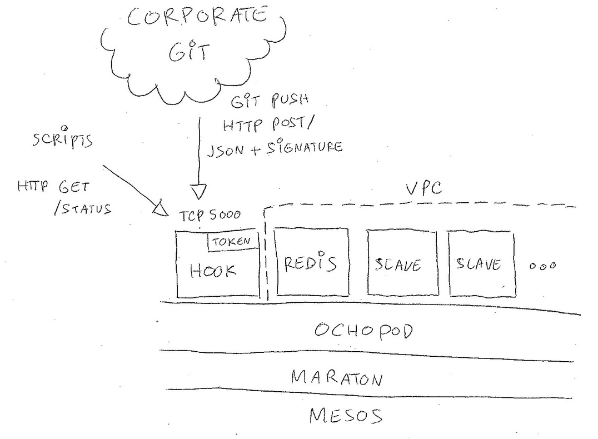

CI
==

Overview
________

The driving goal behind this effort is to let developers quickly build and release new Docker_ images but just
defining a build script and pushing their code to Git_. This is heavily influenced by the rather successful
Travis_ CI model where all the logic defining the *integration* resides directly in the repository.

We wanted in addition to provide a flexible way to define and deploy new build slaves ready to interact with
third-party systems such as Jenkins_ or Hipchat_. Those slaves are fully containerized and can be easily customized.

Our CI backend is running on top of a Mesos_ cluster using our open-source Ochopod_ mini-PaaS. It is formed by
deploying a few self-configuring containers: the receiving *hook*, a small *redis* acting like a job queue and one
or more *slaves*. The *hook* is an edge node reachable from at least the Git_ backend and acts as a sink that receives
push notifications (authenticated via a SHA1 signature). The rest of the containers can be placed in a VPC if needed.

Integrating with Git
____________________

Setting your hook
*****************

In order to connect your Git_ repository with the CI backend you simply have to define a web hook in your
repository settings.

.. note::
    You **must** specify a secret token when configuring your web hook. This secret is by default randomly generated
    by the *hook* container when it boots. You can use our Ochothon_ CLI interface to retrieve it.

Once your web hook is enabled add a YAML_ file called *integration.yml* at your repository root. This file will be
used by the backend upon a *git push* to execute shell snippets on one of the build slaves.

The current operating model is to only trigger the build for the *master* branch. Pushes to any other branch will be
silently ignored. The backend will assign each git repository to a given slave (e.g it is sticky and all builds
for repository foo/bar will take place within the *same container*).

Specifying hints
****************

The CI backend may run multiple slaves each with its own capabilities. You can pass one or more hints via the web
hook URL by concatenating them (separate with plus signs). For instance if you need a slave that allows you to use
JDK8 and SBT you could set your web hook to:

.. code:: bash

    https://ci-backend/JDK8+SBT

In that case the backend will attempt to find a suitable slave by matching the first one offering all the requested
hints. Specifying hints and not being to match a slave will result in a failure via a HTTP 403.  Not specifying any
hints (e.g basic web hook URL with no path) will assign the build to a random slave.

.. note::
    Each slave declares its capabilities via its *cluster name*. For instance if you spin up a slave container
    called *slave-foo-bar* it will register itself has having capabilities *foo* and *bar*.

Defining your build
___________________

Integration.yml
***************

The top-level *integration.yml* is made or one or more build *steps*. Each step has a title and is made of one or
more shell snippets. A single step build could be as simple as:

.. code:: YAML

    step:  say hello
    shell:
    - echo hello

You can layout *integration.yml* as a single step like the example above or as an array of steps.

Working directory and environment variables
*******************************************

Each build step can be located into an explicit sub-directory (the default being the repository root). Simply define
the **cwd** attribute to wherever you wish your shell snippets to run from. For instance if you wish to build your SBT_
project which is located in the /app subdirectory you could do:

.. code:: YAML

    step:  build my SBT app
    cwd:   app
    shell:
    - sbt clean
    - sbt compile

Additionally your shell snippets will be provided a few useful environment variables:

 - $HOST : build slave hostname
 - $COMMIT : git commit hash (full length)
 - $COMMIT_SHORT : git commit hash (short version)
 - $MESSAGE : git commit message
 - $TAG : repository name
 - $TIMESTAMP : git push timestamp
 - $LOG : current build log as a serialized JSON_ array (abridged version)
 - $OK : "true" if the build is still going on smoothly, "false" if it failed earlier

You can also define your own environment variables in a given build step by using the optional **env** attribute. It
should be set to a set of key/value pairs. For instance you can define $FOO by doing:

.. core:: YAML

    step:  build my SBT app
    cwd:   app
    env:
      foo: bar
    shell:
    - sbt compile

You can use those for instance to craft a build tag to be included in your Docker_ image (very handy to pass down
build information):

.. code:: YAML

    step:  craft a build tag
    shell:
    - echo "$MESSAGE ($COMMIT_SHORT)" > BUILD

By default the standard output from the shell snippets is not recorded. You can however turn it on by specifying
the **debug** attribute and set it to *true*.

Build outcome
*************

By default any shell snippet that does not exit with a zero code will trip the build. All subsequent snippets will
then be skipped. You can force executing shell snippets even if the build has failed by pre-pending with *no-skip*.
This mechanism is handy to guarantee always sending post-build notifications of instance.

As an example the following example will always run the echo command despite the fact the build is failing:

.. code:: YAML

    step:  always echo no matter what
    shell:
    - 0xdeadbeef
    - no-skip echo hello

Build status
************

You can always query the backend to check what your Git_ repository build status is. Just **HTTP GET /status** on
the git hook target. For instance let's pretend you wish to check the status for the *paugamo/test*
repository:

.. code:: bash

    $ curl -H "Accept: text/raw" http://ci-backend/status/paugamo/test
      - commit 44d27e9096 (CSE-129 updated Dockerfile to fix the build)
      - add a label, build and push the resulting docker image to paugamo/test
      [passed] echo "$MESSAGE ($COMMIT_SHORT)" > BUILD... (0 seconds)
      [passed] tools push -t latest paugamo/test -d... (27 seconds)
      - notify hipchat
      [passed] if [ -n "$OK" ] ; then   tools hipchat -c green 883987 "build pa... (0 seconds)
      [passed] tools jenkins view/CSE/job/Test... (1 seconds)

Tools
_____

The *build slaves* come by default equipped with a set of tools you can invoke from your the shell. Those tools are
installed as a dedicated Python_ package and all support a *-d* switch to turn verbose logging on.

Docker
******

The *push* tool will perform a Docker_ build & push in one go. A valid *Dockerfile* is expected to be found wherever
the tool is run from. The tool will by default push the image using the *latest* tag. You can specify one or more
tags to push against by using the *-t* switch.

.. note::
    The underlying host machine Docker_ credentials will be used when pushing the image. The tool actually talks
    to the Docker_ daemon of the host via the remote API. The daemon's unix socket is mapped via *socat* to TCP 9000
    within the slave container.

Simply building and pushing an image is quite easy:

.. code:: YAML

    step: build and push a test image
    shell:
    - tools push paugamo/test

You can use the Git_ commit hash to version your image (using it as a tag):

.. code:: YAML

    step: build and push a versioned test image
    shell:
    - tools push -t $COMMIT_SHORT paugamo/test

You want to use Quay_ as your target registry ? No problemo:

.. code:: YAML

    step: build and push a to quay
    shell:
    - tools push quay.io/paugamo/test

Hipchat
*******

The *hipchat* tool is a cheap but effective way to let your integration build perform notifications. You just need
to specify the room number (look in your Hipchat_ UI to find what it is). The notification color can be specified
using the *-c* switch (pick from the colors supported by the Hipchat_ API such as *green* or *red*). For instance:

.. code:: YAML

    step: build and push a versioned test image
    shell:
    - tools hipchat 1509036 "build started for $TAG ($COMMIT_SHORT, $MESSAGE)"
    - tools push -t $COMMIT_SHORT paugamo/test

Jenkins
*******

The *jenkins* tool allows you to trigger a specific Jenkins_ job and create it if not already there. The template we
use is to setup the job so that it pings the CI backend to grab the build status. You can then free to customize the
job in Jenkins_ directly to trigger downstream build events.

You just need to specify the Jenkins_ job path. If you for instance want to have Jenkins_ be notified of the outcome
of a build via the *Test* job nested under the *CI-Tests* folder you could do:

.. code:: YAML

    step: build and push a versioned test image
    shell:
    - tools hipchat 1509036 "build started for $TAG ($COMMIT_SHORT, $MESSAGE)"
    - tools push -t $COMMIT_SHORT paugamo/test
    - no-skip tools jenkins CI-Tests/job/Test

.. note::
    The *no-skip* token is used in that case to guarantee we notify Jenkins_ even if the build failed. In that case
    Jenkins_ will by default CURL the CI backend and record there was a failure.

.. _Docker: https://www.docker.com/
.. _Git: https://github.com/
.. _Hipchat: https://www.hipchat.com/
.. _Jenkins: https://jenkins-ci.org/
.. _JSON: http://www.json.org/
.. _Mesos: http://mesos.apache.org/
.. _Ochopod: https://github.com/autodesk-cloud/ochopod
.. _Ochothon: https://github.com/autodesk-cloud/ochothon
.. _Python: https://www.python.org/
.. _Quay: https://quay.io/
.. _SBT: http://www.scala-sbt.org/
.. _Travis: https://travis-ci.org/
.. _YAML: http://yaml.org/
